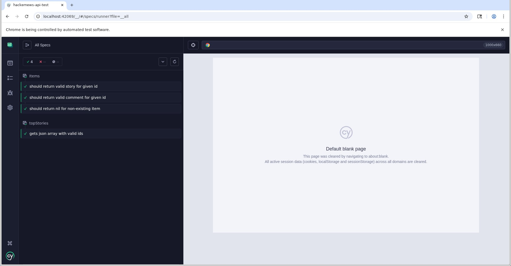

# hackernews-api-test
Hacker news API acceptance testing using cypress

## Requirements:
Assuming npm and Node.js is already installed run the following commands:
npm install cypress --save-dev
npm install --save-dev cypress-schema-validator

## Running the tests:
There are two ways to run the tests:

### CLI:
To run all the tests in CLI run: npx cypress run

### Browser:
To run the tests in a Browser run: npx cypress open
Once the Cypress window opens choose E2E test followed by choosing the preferred browser
This should open the browser with the specs test suites. Either choose to run all tests or choose the specific test suite to run it.

